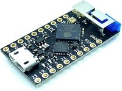
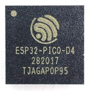
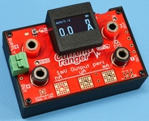
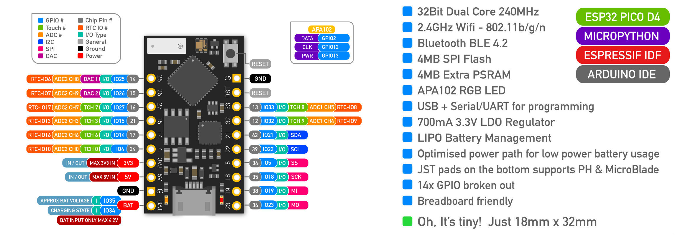
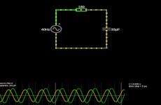

## Welcome to EmSys 2020 CSC-368/CSCM68
Welcome to EmSys (Embedded Systems). 
This repository contains various useful bits and pieces for the course, such as a schedule, datasheets, and various other things.
For this course, I will primarily use GitHub to host lecture and lab content. Below is a table detailing the lecture and labs' timing, along with links to the relevant GitHub page. Most of the repositories are currently private but will be made public before the appropriate lab/lecture. 

### Useful links
* Setting up your EmSys lab environment [[here](https://github.com/STFleming/EmSys_labSetup)]
* Machine allocations [[here](https://github.com/STFleming/EmSys_labSetup/tree/main/allocations)]
* Latest virtual lab url [[here](http://ec2-52-15-138-171.us-east-2.compute.amazonaws.com:4000/)]

-----------------------------------------------------------------------------------
### Course Schedule
| Week  | dates       | Lecture (Tuesdays 16:00 - 18:00)                                                          | Labs (Fridays 15:00 - 17:00)                                                                                     | 
|-------|-------------|-------------------------------------------------------------------------------------------|------------------------------------------------------------------------------------------------------------------|
| 1     | 25/01-29/01  | [Introduction](https://github.com/STFleming/EmSys_Lecture1);                              |                                                 |
| 2     | 01/02-05/02  | [Labs and HW/SW Interface](https://github.com/STFleming/EmSys_LabIntro_MemoryMappedHardware);      |                                                 |
| 3     | 09/02-12/02  | [GPIO and Abstraction Costs](https://github.com/STFleming/EmSys_GPIO_and_Abstraction_Costs)  |    [Lab 1 Start 10/02/2020](https://github.com/STFleming/EmSys_Lab1)                                                                                                              |
| 4     | 15/02-19/02  | [Analogue and Digital](https://stfleming.github.io/EmSys_Analogue_and_Digital)                 |                                                                                                                  |
| 5     | 22/02-26/02  | [PWM and Hardware Timers](https://github.com/STFleming/EmSys_PWM_and_HW_Timers)                 |             |
| 6     | 01/03-05/03  | [[mini-lecture lab setup](https://www.youtube.com/watch?v=UkjcmOvF6Mw&ab_channel=ShaneFleming)] [[mini-lecture interrupts](https://youtu.be/OHArGGwXDtI)] |  Lab 1 logbook due 11:00 01/03/2020; [Lab 2 Start 01/03/2020](https://github.com/STFleming/EmSys_Lab2)                                                                                                              |
| 7     | 08/03-12/03  | [Worst-Case Execution Time and RTOS](https://github.com/STFleming/EmSys_Worst_Case_Execution_Time)     |                                                                                                                  |
| 8     | 15/03-19/03  | [Power Consumption](https://github.com/STFleming/EmSys_Lecture7) | Lab 2 logbook due 11:00 20/03/2020; [Lab 3 Start 12/03/2020](https://github.com/STFleming/EmSys_Lab3) |
| 9     | 22/03-26/03  | [Maths -- Hardware, Errors, and Performance](https://github.com/STFleming/EmSys_Lecture8)   |                                                                                                                  |
| 10    | 29/03-02/04  | [Custom Hardware and Acceleration (FPGAs)](https://github.com/STFleming/EmSys_Lecture9)                            |                                                                                                                  |
| 11    | 05/04-09/04  | Break                                                                                     |                                                                                                                  |
| 12    | 12/04-16/04  | Break                                                                                     |                                                                                                                  |
| 13    | 19/04-23/04  | Break                                                                                     |                                                                                                                  |
| 14    |  | [Fault Tolerance](https://github.com/STFleming/EmSys_Lecture10)                                                           |                                                                                                                  |
| 15    |  | Revision Lecture or Extra lab                                                           | Coursework Deadline due 11:00 19/04/2020                                                                         |

Lectures are every Tuesday at 16:00.
Link to the Zoom lecture: [here](https://swanseauniversity.zoom.us/j/91305669799?pwd=L0NhQlRQMnlOZWQxblp0TEFrSUVlZz09) passcode: 411246 

### Lecture Recordings
| Week  | dates       |  Recording                                                             |
|-------|-------------|-------------------------------------------------------------------------------------------|
| 1     | 25/01-29/01  | [Introduction](https://swanseauniversity.zoom.us/rec/share/gkvoHapmdDuxbSCXoAZfUMENttcLPyKbxITJROn7lPzjQ6m7xJyt6LFhYFybcLDg.KUccKj8NaIK-s6kL?startTime=1611676186000)                              |          
| 2     | 01/02-05/02  | [Labs and HW/SW Interface](https://swanseauniversity.zoom.us/rec/share/VHZfQuRQ5KKBLDydeet2iUWsPt-hQwPT4GMorPA5xoWZO8SVdsd6fXKnoe7f2kOf.iWZcttljWdw0a5gG?startTime=1612281398000)      |
| 3     | 09/02-12/02  | [GPIO and Abstraction Costs](https://swanseauniversity.zoom.us/rec/share/_zmA_gv90_ikaL0tq_fmaSXHk3CgGKkrXCMtuRLF0xPGK5Q9LlmxHyAKzGX4cNH1.Ww2VWlbzeMnm34q8?startTime=1612886843000)  |
| 4     | 15/02-19/02  | [Analogue and Digital](https://swanseauniversity.zoom.us/rec/share/iHJXy0K7DcbBz91yZ_IwcUhNkG2oJ-VE0F5hm2YjWywLMezmMWFm5McYit0Ygyg6.we0uVGLYwfVBBugC?startTime=1613490997000)  |
| 5     | 22/02-26/02  | [PWM and Hardware Timers](https://swanseauniversity.zoom.us/rec/play/nN_Cztjf__LNQaDkIO7or6V8MxYto9tNf4BWrsz_f4RNJqu8xsK_zzuRO0PrZqSxeavm24q--s1KF37H.Ew4yzgI7mk0UL3DG?startTime=1614095098000)  |
| 6     | 01/03-05/03  | [Interrupts](https://youtu.be/OHArGGwXDtI)  |
| 7     | 08/03-12/03  | [WCET and RTOS](https://swanseauniversity.zoom.us/rec/share/nNxbocr8Qd2FAT2k_96V8uFbIdwQBptcaCa8KMXcRzntAU4T1Kq2MxoGYc4XuVFT.ERacm5pxL-IWThGN?startTime=1615305145000)  |

-----------------------------------------------------------------------------------
### Datasheets & Technical Reference Manuals
| Device                       | Datasheet/Technical Reference Manual                                                                                                               |
|------------------------------|----------------------------------------------------------------------------------------------------------------------------------------------------|
|        | [TinyPico-01](https://www.tinypico.com/ )                                                                                                                                   |
|     | [ESP32 Technical Reference Manual](https://www.espressif.com/sites/default/files/documentation/esp32_technical_reference_manual_en.pdf)            |
|  | [Logic Analyser](https://cdn.shopify.com/s/files/1/1509/1638/files/Logic_Analyzer_Datasheet_e6569a64-4910-4661-9ef3-f431019ab753.pdf?v=1610445451) |
|  | [Low Power Current Amplifier](https://lowpowerlab.com/guide/currentranger/specs-architecture/) |

### TinyPico Pinout

-----------------------------------------------------------------------------------

### Software & Libraries
|  Software   |   Information / Resources  |
|-------------|----------------------------|
|  | [Basic Info](https://www.arduino.cc/en/Tutorial/BuiltInExamples) |
|  | [PulseView Logic Analyser gui](https://sigrok.org/wiki/PulseView) |
|     | [CircuitJs Web simulator](https://www.falstad.com/circuit/circuitjs.html) |
|     |  [ArduinoWebsockets](https://github.com/gilmaimon/ArduinoWebsockets) |
